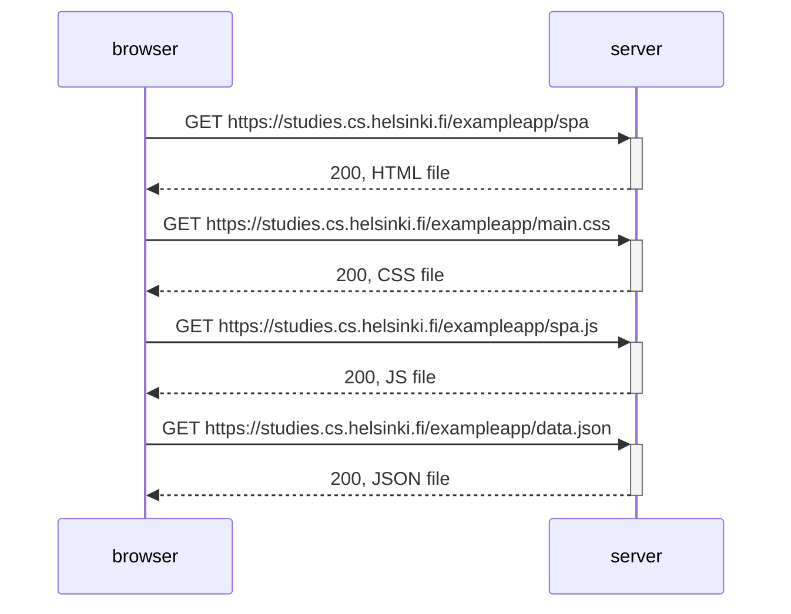

```mermaid
sequenceDiagram
    participant b as browser
    participant s as server

    b->>+s: GET https://studies.cs.helsinki.fi/exampleapp/spa
    s-->>-b: 200, HTML file

    b->>+s: GET https://studies.cs.helsinki.fi/exampleapp/main.css
    s-->>-b: 200, CSS file

    b->>+s: GET https://studies.cs.helsinki.fi/exampleapp/spa.js
    s-->>-b: 200, JS file

    b->>+s: GET https://studies.cs.helsinki.fi/exampleapp/data.json
    s-->>-b: 200, JSON file
```